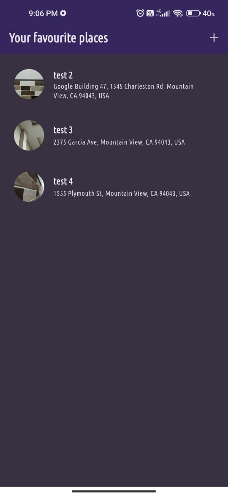
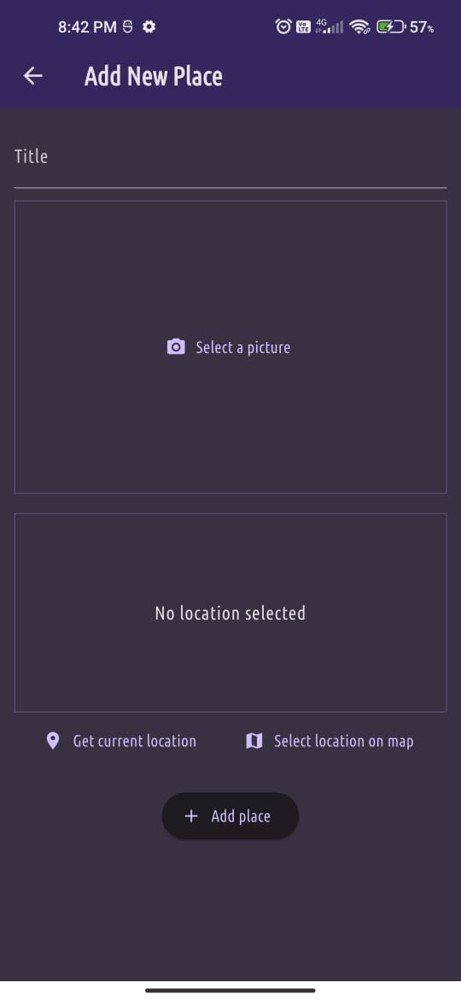
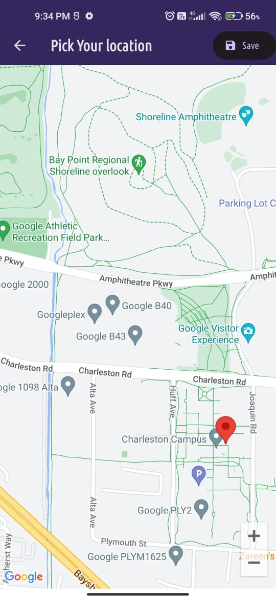
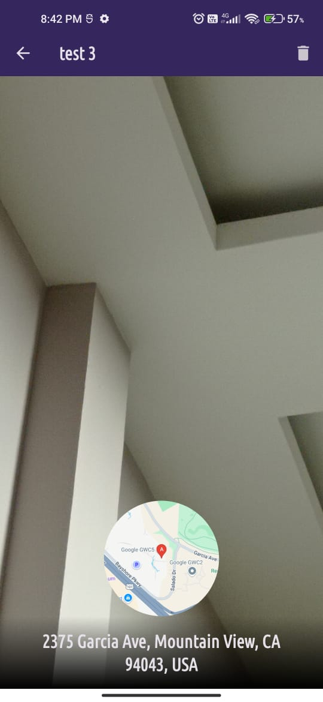
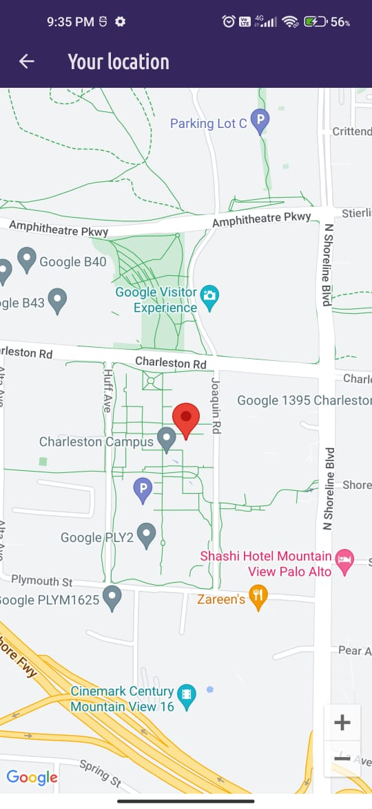
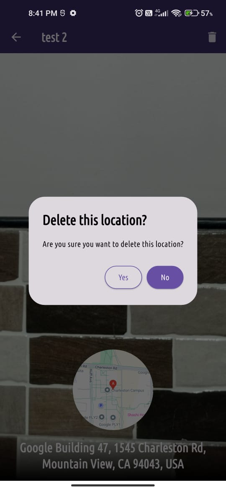

# Meals App

## Table of Contents
- [Introduction](#introduction)
- [Features](#features)
- [Technologies Used](#technologies-used)
- [Setup Instructions](#setup-instructions)
- [Usage](#usage)
- [Screenshots](#screenshots)
- [Credits](#credits)
- [Contact](#contact)

## Introduction
A Flutter project that provides an interface to add/delete your favourite places by clicking an image, giving them a name and selecting their location using Google Maps.

## Features
 - A multiscreen app that uses Images, Google Maps package and stores all the data produced locally on your device. Project made as a part of learning Flutter.

 - **Various other packages inlcude:**
   - Uuid - For dynamic id creation for location.
   - flutter_riverpod - Providing data and it's related methods throughout the project.
   - image_picker - Allows picking of an image from the gallery or clicking a picture through the local device camera.
   - location - Allows for location related services.
   - http - To post or get the required data over the web.
   - google_maps_flutter - Allows for picking of a location through Google maps and it's various APIs'.
   - path_provider - This package helps in getting the directory to store the data on the local device that's produced by the application.
   - path - This package helps in dealing with path related services and accessing various files like images and even databases.
   - sqflite - Provides for the storage of data in a tabular format in SQL syntax
     
- **View favourite locations:** Allows for viewing of locations that are added as favourites.
- **Add favourite locations:** Allows for adding of locations by adding title, image and location.
- **Delete locations:** Locations can be deleted from the location details screen.

## Technologies Used
- **Flutter:** Framework and its various packages.
- **Dart:** Primary programming language.

## Setup Instructions
1. **Install Flutter and Android Studio:**
    Make sure you have the necessary requirements to run a Flutter app on your local machine. Flutter framework, its extensions in VS Code, Android Studio, android emulator (from Android Studio) to run your apps and see them how they look on screens (Alternatively, you can run apps on your actual mobile devices too).

2. **Clone the repository:**
   Type the following commands in your terminal after you have directed it to a particular directory.
   
   - git clone https://github.com/amaanshaikh2114/Favourite_places_app.git

    
## Usage
1. **Run the application:**
    Go to the directory where you have placed the project and type 'flutter run' in the terminal. Ensure flutter is recognized by your system by making sure it's in the 'Path' option of System variables by going to the environment variables of your system.

2. **Add locations:**
    Give a title, take a picture of the location as you want and finally press 'Get current location' to get the location of the current place automatically or select the location manually on the maps.

3. **View location:**
   The different locations can be viewed on the home page each opening into a detailed view, displaying the image, readable address and location on Google Maps.

4. **Delete location:**
    To delete a location the location details screen of that location needs to be opened. After that the trash icon button on the top right corner of the screen can be clicked to delete the location.
   

## Screenshots

  <figure>
    <figcaption align="center">Home page</figcaption>
    
  </figure>
  
  <figure>
    <figcaption align="center">Add location screen</figcaption>
    
  </figure>

  <figure>
    <figcaption align="center">Picking location on maps</figcaption>
    
  </figure>

  <figure>
    <figcaption align="center">Place details screen</figcaption>
    
  </figure>

  <figure>
    <figcaption align="center">Location details</figcaption>
    
  </figure>

  <figure>
    <figcaption align="center">Location deletion</figcaption>
    
  </figure>  

## Credits
'Flutter & Dart - The Complete Guide [2024 Edition]' Course by Maximilian Schwarzmüller on Udemy.

## Contact
For any questions or inquiries, please contact [Amaan Shaikh](mailto:amaanmazhar211@gmail.com). Send a mail to amaanmazhar211@gmail.com
